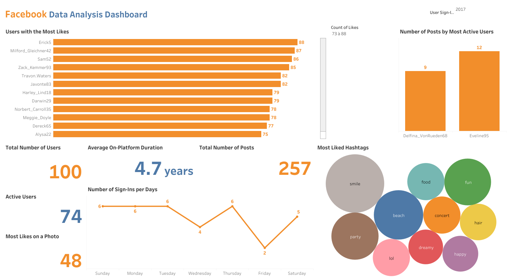

# Facebook Data Analysis Dashboard

Interactive Tableau Public dashboard analyzing user activity, engagement, and content trends on Facebook. It highlights top users by likes and posts, sign-in patterns over the week, most liked hashtags, and overall platform usage metrics.

## Dashboard Highlights

- Top users by likes
- Most active users by post volume
- Sign-in activity by day of week
- Most liked hashtags (bubble chart)
- Overall usage KPIs (users, posts, active users, max likes)

## Tools

- Tableau Public

## Tableau File

The Tableau workbook is available in this same folder as `Facebook Data Analysis Dashboard.twbx`.

## Preview

## Live Dashboard

<iframe src="https://public.tableau.com/views/FacebookDataAnalysisDashboard/FacebookDataAnalysisDashboard?:language=fr-FR&:sid=&:redirect=auth&:display_count=n&:origin=viz_share_link" width="100%" height="850" frameborder="0" allowfullscreen></iframe>

[Open in Tableau Public](https://public.tableau.com/views/FacebookDataAnalysisDashboard/FacebookDataAnalysisDashboard?:language=fr-FR&:sid=&:redirect=auth&:display_count=n&:origin=viz_share_link)
